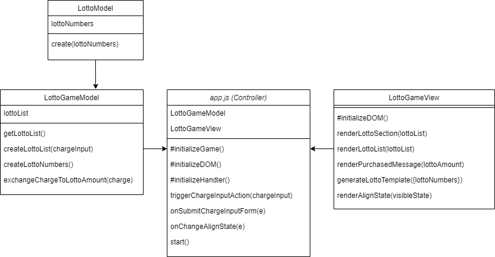
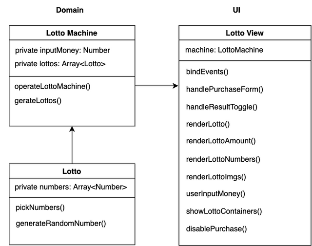
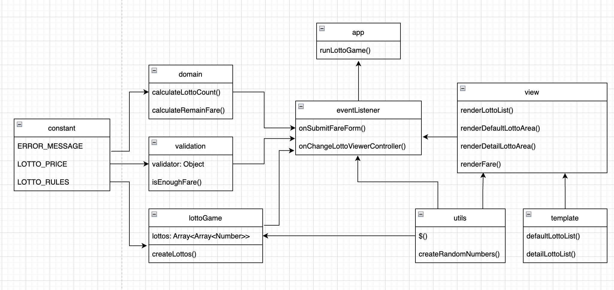

# Level1 Lotto Step1(담당 PR 번호들) - 마르코

- 분석 담당 코드
  - 준찌 [#81](https://github.com/woowacourse/javascript-lotto/pull/81)
  - 유세지 [#82](https://github.com/woowacourse/javascript-lotto/pull/82)
  - 동키콩 [#92](https://github.com/woowacourse/javascript-lotto/pull/92)
  - 온스타 [#85](https://github.com/woowacourse/javascript-lotto/pull/85)
  - 위니 [#96](https://github.com/woowacourse/javascript-lotto/pull/96)
  - 자스민 [#86](https://github.com/woowacourse/javascript-lotto/pull/86)
  - 아놀드 [#84](https://github.com/woowacourse/javascript-lotto/pull/84)
  - 빅터 [#106](https://github.com/woowacourse/javascript-lotto/pull/106)
  - 코이 [#105](https://github.com/woowacourse/javascript-lotto/pull/105)

## 1. 코드 분석

### [#81] 준찌, [#82] 유세지



#### Controller

- 진입점인 index.js가 바로 부르는 RacingGameManager() 클래스에서 .start() 메서드로 시작한다. 해당 클래스는 컨트롤러 역할인 듯하다.

  - start 메서드는 `다른 클래스 인스턴스 생성`, `dom요소 가져오기`, `event 바인딩`을 init한다.

    - (1) model과 view 클래스 인스턴스 생성하여 멤버변수로 할당
    - (2) DOM 요소 가져와서 멤버변수 할당

      - constructor가 없다. 메서드 내부에서 멤버 변수를 만들고 있다.

    - (3) 선택된 DOM 요소에 이벤트 바인딩
      - [네이밍] 핸들러 네이밍을 할 때, 접두사로 on을 붙인다. `onSubmitChargeInputForm`

- controller는 이벤트를 통해 발생한 데이터를 가공하고, view의 렌더링 메서드를 호출하며 그 데이터를 매개변수로 전달한다.

#### View

- constructor 내부에 dom 요소를 멤버변수 할당하지 않고, 프라이빗 메서드 내부에서 dom 요소를 멤버변수로 할당하여 사용하고 있다.
- render하는 메서드들은 매개변수로 렌더링할 데이터를 (컨트롤러로부터) 받고 있다.
- view가 model에 의존하고 있지 않다.

#### model

- model에는 `LottoGameModel`과 `LottoModel` 2개가 있다.
  - 그런데 두 모델의 네이밍이 와닿지 않는다는 리뷰어의 의견이 있었다. ["Lotto 클래스는 어떤 정보를 담는 녀석인지, LottoGame은 또 어떤 녀석인지, 이름만 봤을 때 대략적으로라도 유추할 수 있는 네이밍을 고민해보시면 좋겠어요."]
- controller에서 의존하고 있는 model인 LottoGameModel은 lottoList(2차원 배열)만 멤버변수로 관리하고 있다.
- LottoGameModel이 의존하고 있는 LottoModel은 lottoNumbers(1차원 배열, 길이 6)만 멤버변수로 관리하고 있다.

#### 클로저 활용

- 6개 랜덤 숫자가 담긴 lotto 배열 만들 때, closure 사용

```jsx
function shuffle(array) {
  const copy = [...array]; // 값을 받을 때 깊은복사

  copy.sort(() => Math.random() - 0.5); // random은 0과 1사이 랜덤값이고 sort메서드의 compareFunction은 음수냐 양수냐를 기준으로 두 값씩 비교하며 정렬하므로, 값들이 한 쪽으로 편중되지 않도록 random 값에 0.5를 빼서 음수 또는 양수가 랜덤하게 나오도록 compareFunction을 만들어서 사용한다.

  return [...copy]; // 값을 반환할 때도 깊은복사하여 반환
}

function lottoNumberClosure() {
  const pickNumbers = shuffle([...new Array(45)].map((_, idx) => idx + 1)); // [1,2,3,4,...,45] -> 섞어서

  return () => pickNumbers.pop(); // 배열에서 마지막 값을 하나씩 반환하고 배열에서 제거
}

class Lotto {
  constructor() {
    this.lottoNumbers = this.createLottoNumbers();
  }
  createLottoNumbers() {
    const getLottoNumber = lottoNumberClosure();
    // getLottoNumber()는 1부터 45 사이의 값 중 하나를 반환하고, 한 번 반환된 값은 다시 반환되지 않는다.
    return [...new Array(6)].map(() => getLottoNumber());
  }
}
const lotto = new Lotto();
console.log(lotto); // Lotto { lottoNumbers: [ 7, 14, 45, 33, 18, 36 ] }
```

### [#92] 동키콩, [#85] 온스타



- MVC에서 벗어나, 뷰로직과 비즈니스 로직을 분리하는데에만 집중하였다고 한다. `뷰에서 입력을 받고` `비즈니스 로직을 통해 데이터를 가공하여` `다시 뷰에서 렌더링`하는 방식으로 구현을 하였다.

  - 리뷰어는 이에 대해 `View 영역이 너무 방대해진 것` 같다는 의견을 주기도 했다. 이를 해결하기 위해, `도메인과 UI를 연결할 수 있는 Controller와 같은 영역의 추가`를 제안했다.
  - "꼭 특정 패턴을 맹목적으로 따르고 일부러 구조를 맞출 필요는 없지만 현재 고민하시는 내용에 MVC 패턴이 아이디어를 제공할 수 있을 것 같습니다"

- DOM이 로드되면, 처음 발생하는 인스턴스는 LottoView 클래스의 인스턴스이다. LottoView의 constructor에서 인스턴스 발생시 , LottoMachine(모델, 멤버변수 #inputMoney / #lottos / #strategy) 클래스의 인스턴스를 만들고, 이벤트를 바인딩하였다.
  - LottoMachine 클래스에 있는 generateLottos() 메서드에서 Lotto(모델) 클래스의 인스턴스를 찍어내여 구입한 개수의 Lotto들의 2차원 배열을 만든다. 즉, LottoMachine 클래스는 받은 돈으로 로또들을 Lotto 클래스(로또 한 장을 책임)를 통해 만드는 책임을 지녔다.
  ```jsx
    generateLottos() {
    return Array(this.lottoQuantity)
      .fill()
      .map(() => new Lotto(this.#strategy).generate());
  }
  ```

### [#96] 위니 , [#86] 자스민

- MVC 패턴을 사용했다.
- Controller는 model과 view(resultView, inputView)에 의존한다.
  - 또한, Controller가 DOM을 조작하고 있고 이벤트 바인딩까지 해주고 있다. 그리고 이벤트의 콜백함수로서 비즈니스 로직 메서드들을 두고 있다.
    - > DOM 조작은 View의 역할로 보고 나눠주는 것이 어떨까? DOM 조작과 이벤트 바인딩은 View에서 하도록 분리할 수도 있을 것 같다.
- view는 담당하는 화면 섹션에 따라 resultView, inputView로 분리해준 것 같다. 관리하는 DOM 멤버 변수는 렌더링을 받을 요소들로만 지정하고 있고, 메서드들 또한 어디에 어떤 HTMLString을 주입할 지 시키는 대로 하는 역할을 수행하고 있다. View의 역할 분리가 잘 된 것 같다.

### [#84] 아놀드, [#106] 빅터



- 클래스를 사용하지 않고 함수와 객체만을 이용하여 프로그래밍을 하였다. 또한, MVC처럼 설계하지 않고 도메인 중심으로 짠 것 같다.
- 코드 진입하면, app.js에서 DOM 요소(금액 입력 폼, 체크박스) 를 선택하여 각각의 이벤트를 바인딩한다.
  - 이벤트의 콜백함수는 eventListener.js에 모아두었고, 이를 import해서 사용한다. eventListener.js에 있는 메서드는 비즈니스 로직을 담당하는 것 같다. 메서드 내부에서 validator 모듈에게 유효성 검사 요청 메시지 전달, lottoGame 모듈에게 데이터 생성 요청 메시지 전달, view 모듈에게 렌더링 요청 메시지 전달 등을 하고 있다.
- lottoGame 모듈은 model 역할에 가까운 것 같고, view 모듈은 이름대로 view역할을 하고 있다. 기존 MVC에서 controller와 비슷한 역할(model과 view를 잇는)은 eventListener.js 모듈이 일부 담당하는 것 같다. 왜냐하면 eventListener.js는 lottoGame.js와 view.js에 의존하고 있으며, view에게 렌더링 요청 시 lottoGame에서 가져온 데이터를 인자로 넘겨주기 때문이다.
- lottoGame 모듈은 모델의 역할을 하지만, 클래스 없이 전역변수와 함수로만 이루어져 있다. 그러면 싱글톤 객체와 같은 역할을 하게 되는 것 같다.
  - 이 때 만약 "여러 라운드의 로또 생성 내역을 히스토리로 보여줘야 할 니즈"가 생길 경우, 어떻게 해결할 수 있을까?
    - 반면, 클래스를 사용했다면, 라운드마다 모델에 새 인스턴스를 생성하고, 히스토리를 보여줄 때 여러 인스턴스의 데이터를 보여주는 방식으로 가능할 것 같다.

### [#105] 코이

- MVC를 사용하였다.
- controller에서 dom 요소를 멤버변수로 두고 이벤트를 바인딩하고 있다. 그리고 콜백함수도 함께 있다.
- element를 disabled해주는 유틸 함수를 따로 빼서 사용하고 있는데, 좋은 것 같다.

```jsx
export const setDisabled = element => element.setAttribute("disabled", true);
```

- view에서 렌더링을 지울 때, replaceChildren()메서드를 활용하고 있다.

```jsx

  resetLottoList() {
    this.lottoNumberList.replaceChildren("");
  }
```

## 2. 피드백 정리

### 아키텍처

- [#84] 누가 어떤 역할을 하고 있는지는 명확히 보이도록 설계하는 것이 좋다.

- [#86] 외부에서 알 필요가 없는 메서드라면 private로 처리해주는게 맞다.

  - 예를들어 전기포트가 있다고 할 때 사용자는 전원을 키고 끄는법에 대해서만 알면 되고 내부에서 어떻게 전기포트에서 열이 올라서 물을 끓이는지 세부적인 내용에 대해 알 필요가 없는 부분과 같은 맥락이다. "중요한 데이터를 외부에서 건드릴 수 없도록 하고, 외부에서 사용하지 않는다"의 맥락을 모두 이 전기포트의 예시에 빗대어 생각해볼 수 있다.

- [#86] MVC에서 event 바인딩하는 함수를 controller보다 view에 두는 것이 일반적이긴 하나, 상황에 따라 자신이 좋다고 판단하고 작성한 코드가 오히려 정답일 수 있다.

  - 일단, 위임을 할지 말지에 따라서도 다르게 가져갈 것 같고 앱의 규모에 따라 다르게 가져갈 여지도 있다. 참고로 view에서 event 바인딩하는 함수를 구현한다면 유지보수 측면에서 원하는 요소를 찾기 쉬울 것 같다는 장점이 있다.

- [#81] Model의 getter 함수에서 깊은 복사를 하여 반환해주는 것은 상황에 따라 전략을 취하면 된다.
  - 깊은 복사를 하여 불변성을 통해 얻는 이점이 해당 코드에서 있다면 할 수도 있다.
  - 그리고 중첩된 객체의 경우 전체 depth를 모두 깊은복사해야 하는 경우도 있겠지만, 1depth까지만 깊은 복사를 해도 충분한 경우, 또는 얕은 복사로도 아무 문제 없는 경우도 많다.
  - 그리고 성능최적화가 고도로된 V8 엔진에서는 깊은 복사를 해도 발생하는 성능 손실은 생각보다 미미하므로, 필요시 깊은복사를 해도 되겠다.
  - (궁금한 점: private class fields와 getter 만을 사용해도 외부에서 해당 객체에 접근하여 변경하는 것을 방지할 수 있는 것 아닌가..?하는 의문이 든다. 이런 경우 굳이 깊은 복사까지 해줘야 외부에서 모델의 객체에 대한 의도치 않은 변경 시도를 방지할 수 있는 것인가? )

```jsx
// 예시
// 유틸
export const deepCopy = object => JSON.parse(JSON.stringify(object));
// 이것은 아마 1depth까지만 깊은 복사가 되는 코드?

// 모델
class LottoGameModel {
  constructor() {
    this.lottoList = null;
  }

  getLottoList() {
    /** getter로 가져간 lottoList를 변경하여도 lottoList의 멤버에겐 영향이 없다. */
    return deepCopy(this.lottoList);
  }
}
```

- [#92] 캡슐화가 잘됐다면 객체가 외부에 반드시 제공해야 되는 기능만 드러내고 나머지는 은닉화해야 한다.
  - 어떤 객체의 getter, setter가 특별한 이유없이 public 이라면 캡슐화를 온전히 적용했다고 보기 어렵다. 캡슐화가 잘됐다면 객체가 외부에 반드시 제공해야 되는 기능만 드러내고 나머지는 은닉화 해야한다.
- [#92] 이벤트 바인딩 시점을 조절해야 하는 것이 아니라면, 이벤트 바인딩을 묶은 메서드를 생성자 안으로 옮기는 것이 낫다.
- [#92] 여러 곳에서 범용적으로 쓰일 법한 함수는 밖으로 옮기는 것이 낫다.
- [#92] 뷰로직과 비즈니스 로직을 분리한다. 비즈니스 로직(=도메인 로직)이란, 실제 서비스의 핵심 기능을 구현하기 위해 `데이터를 어떻게 가공하고 관리할 것인가` 전반에 걸친 로직을 포함한다. https://en.wikipedia.org/wiki/Business_logic
  - 비즈니스 로직은 데이터가 생성, 저장 및 변경될 수 있는 방법을 결정하는 것이다. 반면, 그 외의 로직은 데이터베이스를 관리하거나 사용자 인터페이스를 표시하거나 일반적으로 프로그램의 다양한 부분을 연결하는 하위 수준 세부 정보와 관련되어 있다.

### 함수/클래스

- [#105] 특정 길이만큼 배열을 만들어서 값을 넣어주려면, `for문과 push 메서드` 대신에 `특정 길이의 빈 배열에 map 메서드`를 쓸 수도 있다.
  - 특정 length의 빈 배열을 만들고 싶을 때, `[...Array(6)]` 또는 `Array.from({ length: 6 })` 를 활용할 수 있다.

```jsx
for (let i = 0; i < count; i += 1) {
  const lotto = new Lotto();
  lotto.generateRandomNumber();
  this.lottos.push(lotto);
}
```

```jsx
this.lottos = Array.from({ length: count }).map(() => {
  const lotto = new Lotto();
  lotto.generateRandomNumber();
  return lotto;
});
```

- [#86] 중복된 값을 저장하지 않는 Set 자료구조 및 해당 메서드(add)등도 활용할 수 있다.

  ```jsx
  const lottoNumberSet = new Set();
  while (lottoNumberSet.size < LOTTO_NUMBERS.LOTTO_LENGTH) {
    lottoNumberSet.add(
      getRandomNumber(
        LOTTO_NUMBERS.MIN_LOTTO_NUMBER,
        LOTTO_NUMBERS.MAX_LOTTO_NUMBER
      )
    );
  }
  return [...lottoNumberSet];
  ```

- [#81] 고차함수를 추천하는 이유 중 하나는 가독성이 좋아지는 점이 가장 크다.
  - map 메서드로 리팩토링 사례

```jsx
// before
const lottoList = [];
for (
  let lottoCount = 0;
  lottoCount < availableLottoAmount;
  lottoCount = lottoCount + 1
) {
  const lottoNumbers = this.createLottoNumbers();
  const lotto = Lotto.create(lottoNumbers);
  lottoList.push(lotto);
}
```

```jsx
// after
const lottoList = [...new Array(availableLottoAmount)].map(() => new Lotto());
```

- [#81] Prototype에 커스텀 메소드를 추가해서 사용하는 것 주의
  - Prototype에 커스텀 메소드를 추가해서 사용하는 것은, 내장 객체가 가지는 전역 범위때문에 생길 수 있는 변경 가능성 때문에 별로 추천하는 방법이 아니다. 또한, 유틸성 함수의 역할로 쓰려는 목적이라면 명시적으로 유틸 함수를 정의하고 모듈화하는 것이 더 좋다.
  - built-in 객체의 prototype에 이미 있던 함수를 새로운 내용으로 변경하는 것은 당연히 위험한 일이니 지양하는게 맞는데,
    개인적으로는 built-in 객체의 prototype에 새로운 내용을 추가하는 것 역시 권장하고 싶지 않습니다. 다른 모듈(파일)들을 작업하는 협업자 입장에서는 deepCopy라는 메서드가 있는지 여부를 알기 어려워서 안쓰게 될 확률이 높아요.
    명시적으로 import해서 쓸 수 있도록 static한 함수로 구현하는 것이 더 좋다고 생각해요. 그렇게 하면 prototype 체이닝상의 존재여부와 무관하게 다른 객체들도 쓸 수 있을테니까요. (deepCopy는 배열 뿐 아니라 객체에서도 쓰기 좋은 함수입니다).
    굳이 this 및 prototype 체이닝을 이용한 '메서드'로 써보고 싶다! 라고 하면, Array를 extends하는 새로운 subClass를 만들어서 그 안에 method를 정의하는 편이 좋습니다. 이러면 앞서 설명드린 문제점들은 모두 해소됩니다. 다만 이 경우엔 리터럴 선언 방식은 유효하지 않다는 점이 아쉽긴 한데, prototype 메서드를 활용하고자 하는 니즈와 이 아쉬움 사이에서 잘 저울질해서 선택하면 되겠죠.

```jsx
Array.prototype.deepCopy = function () {
  return JSON.parse(JSON.stringify(this));
};
```

- [#82] `new.target` 사용

  - [new.target](https://developer.mozilla.org/ko/docs/Web/JavaScript/Reference/Operators/new.target)
    - new.target 속성(property)은 함수 또는 생성자가 new 연산자를 사용하여 호출됐는지를 감지할 수 있습니다. new 연산자로 인스턴스화된 생성자 및 함수에서, new.target은 생성자 또는 함수 참조를 반환합니다. 일반 함수 호출에서는, new.target은 undefined입니다.

- [#82] 드모르간 법칙을 활용하여 every 메서드에서 some 메서드로 변경하면 더 효율적인 로직일 수 있다.
  - 조건을 '모두 충족시켜야만' true가 반환되는 every보다는, 이를 뒤집어서 '일부 조건이라도 충족시' true가 반환되는 some을 쓰면 좀더 효율적인 검색이 이뤄질 수 있다. (드모르간 법칙 이용)

```jsx
function isValidNumber(lottoNumbers) {
  return lottoNumbers.every(
    number =>
      Number.isInteger(number) &&
      number >= NUMBER.LOTTO_MIN_NUMBER &&
      number <= NUMBER.LOTTO_MAX_NUMBER
  );
}
```

### 컨벤션/네이밍

- [#96] `this.model` 같은 추상적이고 모호한 이름보다 사용하는 곳에서 바로 알 수 있도록 구체적인 이름으로 바꾸는 것이 좋다.

- [#86] 안 쓰는 인자는 언더바(\_)를 사용하면 남들이 이해하기 쉽다.

```jsx
      (e, idx) => idx + 1,  // before
      (_, idx) => idx + 1,  // after
```

- [#81] utils, constants에서 파일을 많이 생성하여, 코드들을 분리하는 것도 명확하다는 장점이 있다.
- [#82] 하나의 로또 티켓에 들어가는 번호가 6개라는 의미로, 6을 값으로 갖는 `LOTTO_NUMBER_LENGTH`라는 변수명에서 `length`는 '자릿수'를 의미하는 것으로 오해할 여지가 있으므로, `length`를 'amount'로 변경해보는 것도 고민해보자.

### 테스트

- [#105] 단위테스트는 어떤 기능 하나에 대한 테스트라고 볼 수 있으므로, 각 파일별로 테스트 파일을 작성하여, 그 파일별로 테스트 코드를 응집하는 게 나을 수 있다.

- [#92] private 메서드는 세부 기능이기 때문에 특별한 경우가 아니라면 테스트 작성하지 않는 편이다. 링크 참고 http://shoulditestprivatemethods.com

- [#92] 랜덤테스트의 가장 큰 문제는 검증을 실패하거나 성공했을 때 왜 성공했는지? 왜 실패했는지? 동일한 상황 재현이 어렵다는 것이다.

  - 랜덤테스트를 진행한다면 여러 테스트 케이스의 히스토리를 캡쳐하고 그 기록을 관리하는 체계가 필요하다.

- [#92] 랜덤테스트를 안하려면 숫자를 테스트할 때 수동으로 입력해줘야 한다.

  - mock, spyOn 등의 키워드로 검색하여 방법 강구
    - > Mock 객체란 모듈의 겉모양이 실제 모듈과 비슷하게 보이도록 만든 가짜 객체이다. 모듈이 필요로 하는 의존성이 테스트 케이스 작성을 어렵게 만드는데, 이 의존성을 단절하기 위해 Mock 객체가 사용된다. https://eminentstar.github.io/2017/07/24/about-mock-test.html
    - > mocking에는 스파이(spy)라는 개념이 있습니다. 현실이나 영화 속에서 스파이라는 직업은 “몰래” 정보를 캐내야 합니다. 테스트를 작성할 때도 이처럼, 어떤 객체에 속한 함수의 구현을 가짜로 대체하지 않고, 해당 함수의 호출 여부와 어떻게 호출되었는지만을 알아내야 할 때가 있습니다. 이럴 때, Jest에서 제공하는 jest.spyOn(object, methodName) 함수를 이용하면 됩니다. https://www.daleseo.com/jest-fn-spy-on/

- 유닛테스트 사례
  - 로또는 1부터 45번까지의 숫자들을 가진다
  - 로또는 총 6개의 숫자를 가진다.
  - 로또의 각 숫자들은 중복되지 않는다
  - 로또 기계는 투입금액에서 로또 가격을 나눈 개수만큼의 로또를 발급해야 한다.
  - 로또 개수에 맞는 개수를 알아야 한다.

```jsx
const calculator = {
  add: (a, b) => a + b,
};

const spyFn = jest.spyOn(calculator, "add");

const result = calculator.add(2, 3);

expect(spyFn).toBeCalledTimes(1);
expect(spyFn).toBeCalledWith(2, 3);
expect(result).toBe(5);
```

- [#81] 유틸 함수에 대한 테스트에 가까울 경우, 서비스 로직 테스트와 분리하는 것이 더 분명한 의미를 전달할 수 있다.

### 함수/메서드 분리

- [#84] 코드를 한 줄로 짜는 것(반환값을 다시 함수의 인자로 넣고 그 반환값을 다시 함수의 인자로 넣는 상황)도 좋지만, 뒤에서부터 읽고 반환값을 추측해야해서 코드를 이해하는 데에는 힘든 점이 있다. 함수에서 반환된 값은 따로 변수에 할당하고, 그 변수를 다른 함수에게 인수로 넘겨주도록 분리하자.

- [#86] 과도한 분리는 오히려 복잡성을 증가시킬 수 있다.

- [#82] 함수/메서드를 분리해야 하는 목적은 `외부에서의 접근수단 제공` 및 `여러 곳에서 호출`을 기준으로 판단해야 한다. 단순히 기능이 다르다는 이유만으로 잘게 분리하면 오히려 혼란을 줄 수도 있다.
  - 아래 코드의 경우 지나치게 잘게 분리되었다고 볼 수 있다. renderLottoList, renderPurchasedMessage는 모두 renderLottoSection 한군데에서만 호출하고 있는, 분리의 목적이 불분명한 메서드들이다. 이런 메서드들은 협업시 다른 사람들로 하여금 혹시 다른데서도 호출하는 곳이 있나? 하는 혼란만 주게 될 수 있지 않는지 고민할 필요가 있다.

```jsx
renderLottoSection(lottoList) {
  this.renderPurchasedMessage(lottoList.length);
  this.renderLottoList(lottoList);
}

renderLottoList(lottoList) {
  this.$lottoContainer.innerHTML = lottoList
    .map((lotto) => this.generateLottoTemplate(lotto))
    .join('');
}

renderPurchasedMessage(lottoAmount) {
  this.$purchasedMessage.innerText = `총 ${lottoAmount}개를 구매하였습니다.`;
}
```

```jsx
// 이 또한 과도한 메서드 분리라고 볼 수 있다. 기능별로 분리를 해두었지만, 실제 호출은 start메서드 한군데에서만 이뤄지고 있기 때문이다.
class LottoGameManager {
  #initializeGame() {
    this.lottoGameModel = new LottoGameModel();
    this.lottoGameView = new LottoGameView();
  }

  #initializeDOM() {
    this.$chargeForm = findElement(SELECTOR.CHARGE_INPUT_FORM);
    this.$chargeInput = findElement(SELECTOR.CHARGE_INPUT);
    this.$alignConverter = findElement(SELECTOR.ALIGN_CONVERTER);
  }

  #initializeHandler() {
    this.$chargeForm.addEventListener("submit", this.onSubmitChargeInputForm);
    this.$alignConverter.addEventListener("change", this.onChangeAlignState);
  }
  start() {
    this.#initializeGame();
    this.#initializeDOM();
    this.#initializeHandler();
  }
}
```

### 예외처리

- [#85] 무한대의 값을 입력할 수 있도록 두면, 일정 금액 이상이 넘어가게 되면 앱이 정지하게 되므로, 예외처리를 해야 한다.

### DOM

- [#86] Element가 받는 value 중 Number Input의 경우 value 대신 `valueAsNumber` 프로퍼티를 사용할 수도 있다.

### CSS

- [#86] 중복되는 CSS 컬러는 CSS 변수로 관리해보자.
  - https://developer.mozilla.org/ko/docs/Web/CSS/Using_CSS_custom_properties
