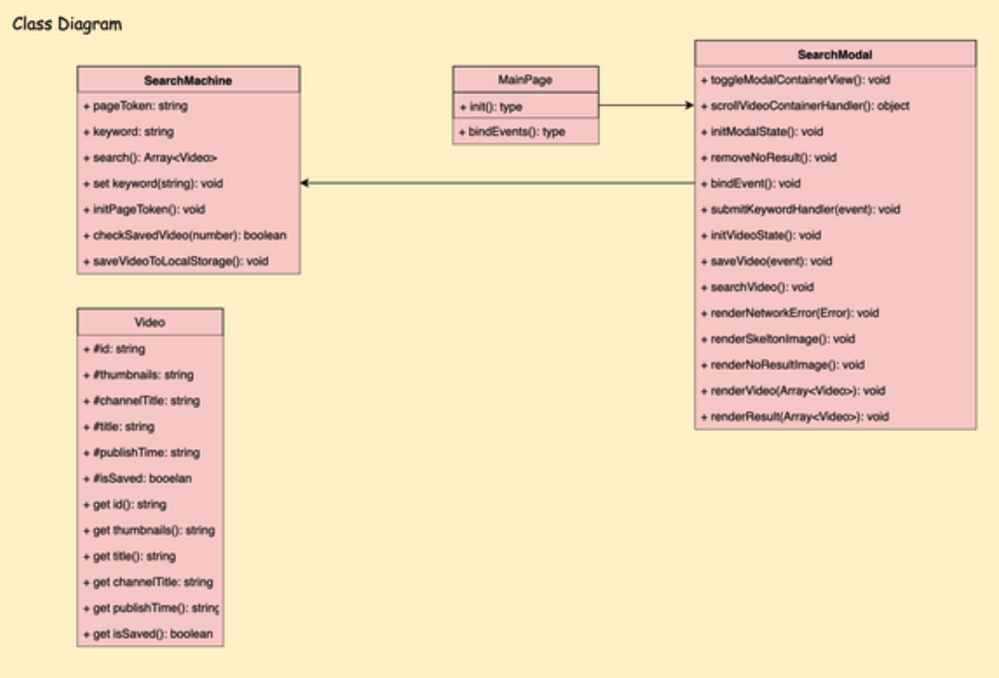

# Level1 Youtube Step1(담당 PR 번호들) - 록바

- 분석 담당 코드
  - 록바 [#88](https://github.com/woowacourse/javascript-youtube-classroom/pull/88)
  - 앨버 [#89](https://github.com/woowacourse/javascript-youtube-classroom/pull/89)
  - 태태 [#93](https://github.com/woowacourse/javascript-youtube-classroom/pull/93)
  - 결 [#86](https://github.com/woowacourse/javascript-youtube-classroom/pull/86)
  - 자스민 [#76](https://github.com/woowacourse/javascript-youtube-classroom/pull/76)
  - 동키콩 [#81](https://github.com/woowacourse/javascript-youtube-classroom/pull/81)
  - 도리 [#85](https://github.com/woowacourse/javascript-youtube-classroom/pull/85)
  - 소피아 [#82](https://github.com/woowacourse/javascript-youtube-classroom/pull/82)
    <br>

## 아키텍처 분석(desc: 담당한 소프트웨어의 아키텍처를 간단히 분석하고 설명합니다)

#### [#76, #81] 자스민, 동키콩

#### 클래스 다이어그램



- 큰 틀로 도메인과 UI를 나누어 설계하였다.
- 도메인

  - SearchMachine
  - SearchMachine에서 접근해서 사용하는 파일(VideoFactory, Video, localStorage)

- UI

  - MainPage
  - SearchModal
  - Templates

#### 인상 깊었던 점

- 1. **template을 관리하는 구조**

  ```jsx
  const template = {
    videoItems: ({...}) => `...`,

    noSearchResult: () => `...`,

    skeletonItem: () => `...`,

    exceedCapacityErrorImage: () => `...`,
  };
  ```

  - template이라는 객체안에 메소드를 만들어 불러올 수 있게끔 구조.

<br>

- 2. **Video 객체를 만들때 사용한 팩토리 패턴과 빌더 패턴**

  ```jsx
  // 호출하는 부분
  data.items.map((item) => VideoFactory.generate(item));

  // 팩토리 패턴
  class VideoFactory {
    static generate(item) {
      const { videoId } = item.id;
      const isSaved = checkSavedVideo(videoId);
      const {
        thumbnails: {
          high: { url },
        },
        channelTitle,
        title,
        publishTime,
      } = item.snippet;

      return Video.Builder()
        .setId(videoId)
        .setThumbnails(url)
        .setTitle(title)
        .setChannelTitle(channelTitle)
        .setPublishTime(publishTime)
        .setIsSaved(isSaved)
        .build();
    }
  }
  ```

  - 팩토리 패턴에 대해서 잘 모른다면, [이 영상 : 6분 8초~](https://www.youtube.com/watch?v=q3_WXP9pPUQ&t=81s)을 추천한다.
  - 팩토리 패턴에 대해서 잘 모른다면, [게시글](https://readystory.tistory.com/117)을 추천한다.
  - 팩토리 패턴을 이용해서, Factory클래스에 접근하는 곳에서 어떠한 일이 일어나는지 예측할 수 없도록 코드를 구상하였다.
  - 내가 생각하는 아쉬운 점 : 현재는 Video에 대한 객체만 생성하는데 팩토리 패턴을 굳이 만들 필요가 있었나 싶다. 시도로는 아주 굿이다.

<br>

- 3. **팩토리 패턴에서, Video 객체를 생성할때 사용한 클로저 활용 빌더 패턴**

  ```jsx
  //호출하는 부분
  Video.Builder()
    .setId(videoId)
    .setThumbnails(url)
    .setTitle(title)
    .setChannelTitle(channelTitle)
    .setPublishTime(publishTime)
    .setIsSaved(isSaved)
    .build();


  //빌더 패턴
  export default class Video {
    ... 필요없는 부분 생략

    static Builder() {
      let id;
      let thumbnails = "NO_THUNBMNAILS";
      let channelTitle = "NO_CHANNEL_TITLE";
      let title = "NO_TITLE";
      let publishTime = "1000/01/01";
      let isSaved = false;

      return {
        setId: function (value) {
          id = value;
          return this;
        },

        setTitle: function (name) {...},

        setThumbnails: function (url) {...},

        setChannelTitle: function (name) {...},

        setPublishTime: function (time) {...},

        setIsSaved: function (saved) {...},

        build: () => {
          if (!id) throw new Error(ERROR_MESSAGE.NO_ID);
          return new Video({
            id,
            thumbnails,
            title,
            channelTitle,
            publishTime,
            isSaved,
          });
        },
      };
    }
  }
  ```

  - 빌더 패턴에 대해서 잘 모른다면, [게시글](https://readystory.tistory.com/121)을 추천한다.
  - 빌더 패턴은 복잡한 객체를 생성하는 방법을 정의하는 클래스와 표현하는 방법을 정의하는 클래스를 별도로 분리하여, 서로 다른 표현이라도 이를 생성할 수 있는 동일한 절차를 제공하는 패턴
  - 내가 생각하는 사용한 의도 : Video 객체에 들어가는 property가 많다보니, 가독성과 선언적으로 구성하고 싶어 사용한 것으로 추측됨.

<br>

## 피드백 정리

## 대분류(ex: 아키텍처, 함수/클래스, 컨벤션, DOM, 테스트 등)

### 1. 아키텍처

#### 1-1 도메인과 UI

- [#76] 도메인과 UI를 굳이 왜 나누어야 하는가? - [바로가기](https://github.com/woowacourse/javascript-youtube-classroom/pull/76#pullrequestreview-907964309)
- domain과 ui를 왜 나누어야하는지 질문을 주셨는데 domain과 ui가 코드가 같이 있다면 ui를 얼마나 재사용 할 수 있을까요? 또한 지금 작성하신 searchModal view를 유투브 검색이 아니라 다른 플랫폼영상 검색 view로 재사용 가능한지 생각해보면 좋을것 같습니다. 소프트웨어 설계에서 '결합도(coupling)'에 대해서 공부하시면 도움이 될듯합니다.
- 관련 키워드 : 낮은 결합도와 높은 응집도 ([내가 추천하는 게시글](https://madplay.github.io/post/coupling-and-cohesion-in-software-engineering))

---

### 2. 함수

#### 2-1. 함수분리

- [#88] throttle하는 함수를 유틸로 분리해보자. - [바로가기](https://github.com/woowacourse/javascript-youtube-classroom/pull/88#discussion_r825303875)

```jsx
//적용 후
const throttle = (func, delay) => {
  let timerId;

  return () => {
    if (!timerId) {
      timerId = setTimeout(() => {
        timerId = null;
        func();
      }, delay);
    }
  };
};
```

  <br>

#### 2-2. 예외처리

- [#76] JSON.parse 할 수 없는 값이 반환된다면 어떻게 될까요? - [바로가기](https://github.com/woowacourse/javascript-youtube-classroom/pull/76#discussion_r825298848)

  ```jsx
  //해당 코드
  const getLocalStorage = (key) => JSON.parse(localStorage.getItem(key)) ?? [];
  ```

  - [[MDN](https://developer.mozilla.org/ko/docs/Web/JavaScript/Reference/Global_Objects/JSON/parse)] 변환할 문자열이 유효한 JSON이 아닐 경우에 syntaxError가 발생한다.

    ```jsx
    //수정한 코드
    const getLocalStorage = (key) => {
      try {
        return JSON.parse(localStorage.getItem(key)) ?? [];
      } catch {
        alert(ERROR_MESSAGE.WRONG_INPUT);
      }
    };
    ```

---

### 3. 클래스

#### 3.1 내장 메소드

- [#86] classList.toggle 상세 기능 - [바로가기](https://github.com/woowacourse/javascript-youtube-classroom/pull/86#discussion_r825563206)

  ```jsx
  //수정 전
  event === "hide"
    ? skeletonUi.classList.add("hide-skeleton")
    : skeletonUi.classList.remove("hide-skeleton");

  //수정 후
  classList.toggle("hide-skeleton", event === "hide");
  ```

  - [[MDN](https://developer.mozilla.org/ko/docs/Web/API/Element/classList)] toggle에 두번째 인수가 있을 때 : 두번째 인수가 `true`로 평가되면 지정한 클래스 값을 추가하고 `false`로 평가되면 제거한다.

<br>

---

### 4. DOM, 이벤트

#### 4-1. DOM

- [#89] document.querySelector vs element.querySelector - [바로가기](https://github.com/woowacourse/javascript-youtube-classroom/pull/89#discussion_r827182868)

  ```jsx
  //해당 코드
  $(".video-item__thumbnail", element).src = thumbnails;
  ```

  - [리뷰어님 답변] 성능을 위한 이런 소소한 개선 좋습니다 👍
  - document.querySelector로 시작한다면 DOM 트리의 최상단에서부터 시작해서 찾게 되고 element.querySelector로 찾게 되면 해당 element부터 시작해서 찾게 됩니다
    물론 요즘이야 워낙 하드웨어가 좋아서 이런 정도는 인지할 수 없을 정도의 미세한 차이지만 **이런 작은 개선들이 조금씩 쌓여서 좋은 프로그램이 될 수도, 반대로 안좋은 미세한 차이들이 쌓여서 나중에는 거대한 똥덩어리가 되기도 하는걸 많이 봤습니다.**
  - 추가적으로 작성해주신 방식이 의도하지 않은 element가 select 되는 것을 막을수 있습니다. 예를 들어서 $('.video-itemthumbnail')이 document부터 시작한다면 DOM tree에서 class name이 video-item\_\_thumbnail인 첫 번째 element를 찾게 되서 엉뚱한 element의 src에 thumbnails가 대입되게 됩니다

<br>

- [#86] innerHTML 보다는 insertAdjacentHTML 사용해 주세요. - [바로가기](https://github.com/woowacourse/javascript-youtube-classroom/pull/86#discussion_r824851095)

  - 리뷰어님이 첨부해준 [참고링크](https://developer.mozilla.org/ko/docs/Web/API/Element/insertAdjacentHTML)

<br>

- [#86] 내용을 지울때 replaceChildren()을 쓰자.

  ```jsx
  //수정 전
  this.videoListContainer.innerHTML = "";

  //수정 후
  this.videoListContainer.replaceChildren();
  ```

  - **헷갈림 주의!!** [Node.replaceChild()](https://developer.mozilla.org/ko/docs/Web/API/Node/replaceChild) vs [Element.replaceChildren()](https://developer.mozilla.org/en-US/docs/Web/API/Element/replaceChildren)
  - MDN에 따르면, **replaceChildren()모든 자식 노드를 비우기 위한 매우 편리한 메커니즘을 제공합니다.**

<br>

#### 4-2. 이벤트 리스너

- [#89] 이벤트를 매핑하는 영역 - [바로가기](https://github.com/woowacourse/javascript-youtube-classroom/pull/89#discussion_r825416052)

  ```jsx
  //해당 코드
  document.addEventListener("click", this.handleCloseModal.bind(this));
  ```

  - 전역에서 사용되는 document에 이벤트 리스너를 추가하게 되면, 불필요한 이벤트 감지가 자주 발생하여 추천하지 않는다.
  - 전역에 매핑된 이벤트 리스너는 의도치 않은 동작을 발생시킬 수 있다.
  - 이벤트를 매핑하는 영역은 내가 다루고 있는 컴포넌트 영역으로 한정하는 것이 좋다.

  <br>

- [#85] 리뷰어님이 생각하는 보통 custom event를 사용하는 경우 - [바로가기](https://github.com/woowacourse/javascript-youtube-classroom/pull/85#discussion_r826997741)
  - 보통은 A 요소와 B 요소가 별도로 역할이 분리되어 있는데 이벤트를 발생시키는 A요소에 있는 값들을 해당 이벤트를 수신하는 상위 컨테이너 B 요소에서 그 전달받은 값 들로 새로운 값으로 가공하거나 변경해서 다른 C 요소에게 전달해야할 때, 각 요소에 대한 의존성을 분리시키고 이벤트에 의존하게 하면서 좀 더 유연하게 처리할 수 있는 장점이 있는것 같아요.

<br>

---

### 5. 클린코드

#### 5-1. 변수

- [#86] 변수를 할당해서 명확히 하자. - [바로가기](https://github.com/woowacourse/javascript-youtube-classroom/pull/86#discussion_r824860673)

  - searchResults는 제대로 값이 들어있을지를 의심하게 만드네요.

        ```jsx
        //수정 전
        await this.searchVideo.handleSearchVideo(this.searchInput.value.trim());
        this.renderSearchVideo(this.searchVideo.searchResults);

        //수정 후
        const searchResults = await this.searchVideo.handleSearchVideo(
          this.searchInput.value.trim()
        );
        this.renderSearchVideo(searchResults);
        ```

    <br>

#### 5-2. 네이밍

- [#89] export default할 class/함수명과 파일명을 일치시키는게 관례이다. - [바로가기](https://github.com/woowacourse/javascript-youtube-classroom/pull/89#discussion_r827201820)

  ```jsx
  //해당코드
  //위치 : src/js/screen/index.js

  export default class ScreenManager{...}
  ```

  - 파일이 많아질 경우 import 된 class/함수명만 보고 파일을 찾아가는 경우가 많다보니 default로 export할 class/함수명과 파일명을 일치시키는게 일반적인 관례이다.

<br>

- [#93] 메서드 네이밍 - [바로가기](https://github.com/woowacourse/javascript-youtube-classroom/pull/93#discussion_r824931787)

  - setStorageVideoList 메서드 네이밍과 로직이 매치가 안되는 거 같습니다. (**메서드명만 보면 saveVideoList 상태값을 통으로 바꿔줄 거 같다는 느낌을 받았습니다**)

    ```jsx
    //수정 전 해당코드
    setStorageVideoList(videoId) {
      this.saveVideoList = [videoId, ...this.saveVideoList];
      localStorage.setItem(VIDEO_ID_LIST_KEY, JSON.stringify(this.saveVideoList));
    }

    //수정 후 해당코드
    saveVideoIdToStorage(videoId) {
      this.saveVideoList = [videoId, ...this.saveVideoList];
      localStorage.setItem(VIDEO_ID_LIST_KEY, JSON.stringify(this.saveVideoList));
    }
    ```

<br>

- [#86] 제 삼자가 변수명만 보고 하고자하는 바를 대충이나마 유추할 수 있도록 하자. - [바로가기](https://github.com/woowacourse/javascript-youtube-classroom/pull/86#pullrequestreview-907390620)

  - `최대 10개`가 아닌, `한 번에 요청하는 개수`가 10개 이기 때문에 수정 - [바로가기](https://github.com/woowacourse/javascript-youtube-classroom/pull/86#discussion_r824836900)

    ```jsx
    //수정 전
    const MAX_VIDEO_COUNT = 10;

    //수정 후
    const GET_VIDEO_COUNT = 10;
    ```

  - **disabled는 어떤 이유에서건 누를수 없는 모든 경우를 아우르는 표현**이니, 좀더 구체적인 의미를 지니는 단어로 표현하자. - [바로가기](https://github.com/woowacourse/javascript-youtube-classroom/pull/86#discussion_r824837973)

    ```jsx
    //수정 전
    const BUTTON_DISABLED_TEXT = "저장됨";

    //수정 후
    const ALREADY_SAVED_VIDEO = "저장됨";
    ```

<br>

---

### 6. HTML, CSS

#### 6-1. HTML

- [#81] modal에 해당하는 semantic tag는 없을까요? - [바로가기](https://github.com/woowacourse/javascript-youtube-classroom/pull/81#discussion_r825378003)
  - [동키콩 답변] 공식문서를 확인 해보니, `<dialog>`태그가 존재한다.
  - [[MDN](https://developer.mozilla.org/ko/docs/Web/HTML/Element/dialog)] HTML `<dialog>` 요소는 닫을 수 있는 경고, 검사기, 창 등 대화 상자 및 기타 다른 상호작용 가능한 컴포넌트를 나타냅니다.

<br>

- [#76] button의 default type은 무엇일까요? - [바로가기](https://github.com/woowacourse/javascript-youtube-classroom/pull/76#discussion_r825261769)
  - button의 기본 default type은 submit이다.

<br>

#### 6-2. CSS

- [#88] 고정된 background, color 값들은 변수로 빼주세요. - [바로가기](https://github.com/woowacourse/javascript-youtube-classroom/pull/88#discussion_r825301665)

<br>

- [#88] NO_RESULT(결과 없음을 나타내는 페이지)는 항상 동일한 화면을 보여주기에 html에 있고, 상태에 따라 show, hide하는 방식을 이용하는게 어떨까요? - [바로가기](https://github.com/woowacourse/javascript-youtube-classroom/pull/88#discussion_r825304921)
  ```jsx
  //해당 코드
  this.searchResult.insertAdjacentHTML("beforeend", NO_RESULT_TEMPLATE);
  ```

---

### 7. 테스트

- [#89] TDD는 어디까지나 더 나은 코드를 작성하기 위해 도움을 줄 수 있는 하나의 방법론일 뿐이지 이 자체가 목적이 되어서는 안된다. - [바로가기](https://github.com/woowacourse/javascript-youtube-classroom/pull/89#pullrequestreview-908108852)

<br>

- [#89] **테스트의 목적** - [바로가기](https://github.com/woowacourse/javascript-youtube-classroom/pull/89#discussion_r827155936)
  - 테스트의 목적은 단순히 기능을 검증하는 데에만 있지 않다.
  - 테스트 코드는 추후에 다른 개발자 혹은 현재의 flow를 망각한 자신에게 테스트 기능에 대한 어떤 flow가 필요한지 보여주는 설명서가 된다.
  - 또 다른 목적은 변경의 감지이다. 코드가 변경됐을 때 그 코드에 의존하고 있던 다른 코드가 변경된 내역을 반영하지 않고 있는 경우를 테스트 코드를 통해 발견할 수 있습니다.

<br>

- [#93] 일관성 있는 테스트 결과를 내려고 하자. - [바로가기](https://github.com/woowacourse/javascript-youtube-classroom/pull/93#discussion_r824926586)
  ```jsx
  //해당코드
  try {
    await searchVideo.handleSearchVideo("playlist");
    expect(searchVideo.searchResults.length).toEqual(MAX_VIDEO_COUNT);
  } catch (error) {
    expect(error.message).toEqual(ERROR_MESSAGE.CANNOT_GET_YOUTUBE_VIDEO);
  }
  ```
  - 에러가 무조건 나는 케이스와 절대 에러 나지 않는 케이스로 각각 나눠서 테스트하면 좋을 것 같습니다.

---

### 9. 기타

#### 9-1. 패키지

- [#89] default 값에 의존하는 것보다는 tab size 같은 최소한의 정의는 명시적으로 표현하는게 좋을 것 같습니다. - [바로가기](https://github.com/woowacourse/javascript-youtube-classroom/pull/89#discussion_r827184610)

<br>

- [#81] `printWidth : 100`을 한 이유가 있을까요? - [바로가기](https://github.com/woowacourse/javascript-youtube-classroom/pull/81#discussion_r825377862)
  - prettier 공식 문서에 따르면, **For readability we recommend against using more than 80 characters:**

<br>

- [#81] --no-cache로 설정한 이유는 있을까요? - [바로가기](https://github.com/woowacourse/javascript-youtube-classroom/pull/81#discussion_r825378085)
  ```jsx
  //해당코드
  "scripts": {
    "test": "jest --watch --no-cache",
  ```
  - [동키콩 답변] 공식문서를 다시 살펴보니 --no-cache를 사용할 경우 jest가 최소 두배이상 느려져 캐싱문제가 생길경우에만 --no-cache를 사용하라고 추천하고 있네요

<br>

- [#81] 버전을 1.0.0으로 하신 이유가 있을까요? - [바로가기](https://github.com/woowacourse/javascript-youtube-classroom/pull/81#discussion_r825378158)
  ```jsx
  //해당코드
  {
    "name": "javascript-youtube-classroom",
    "version": "1.0.0",
  ```
  - package.json 처럼 쓰이는 버전 양식을 [semver](https://semver.org/lang/ko/) 라고 합니다. (**Sementic Versioning의 약자**) 제가 보기엔, 완성된게 아니므로 메이저 버전이 1이 될 수 없을 것 같아요! 그렇기에 0.x.x 요렇게 표기되어야 하지 않을까 싶네요~

<br>

#### 9-2. 좋은 말

- [#81] [동키콩 질문] 어디까지 테스트를 해야하는지 감이 안온다. - [바로가기](https://github.com/woowacourse/javascript-youtube-classroom/pull/81#pullrequestreview-911456941)
  - **테스트 코드는, 직접 "이게 맞나..? 이렇게 디테일 해야해..?" 까지 짜보시는걸 추천드릴께요!** 항상 이야기하면 감이 잘 안오는데, 최대한 할 수 있는데로 다 나눠보시는걸 추천드릴께요!
